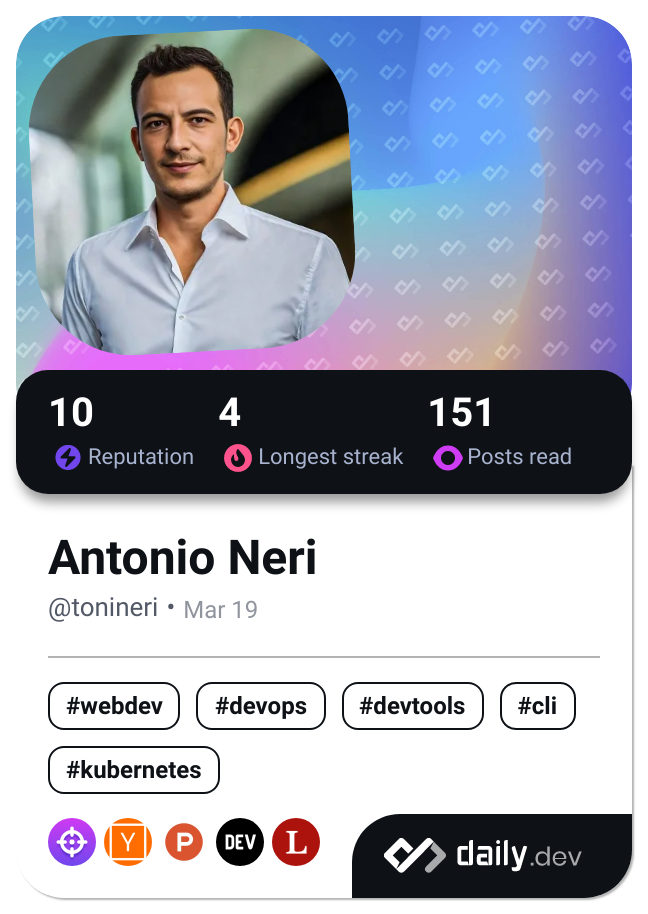

<div align="center">

# `"Hello World"`

</div>

---

<div align="left">
```bash
antonioneri = {
  [address] = "20142 - Milan, Italy"
```


</div>

<div align="right">
  <a href="https://app.daily.dev/tonineri">
    
  </a>
</div>

<div align="center">

[](https://skillicons.dev)

</div>

